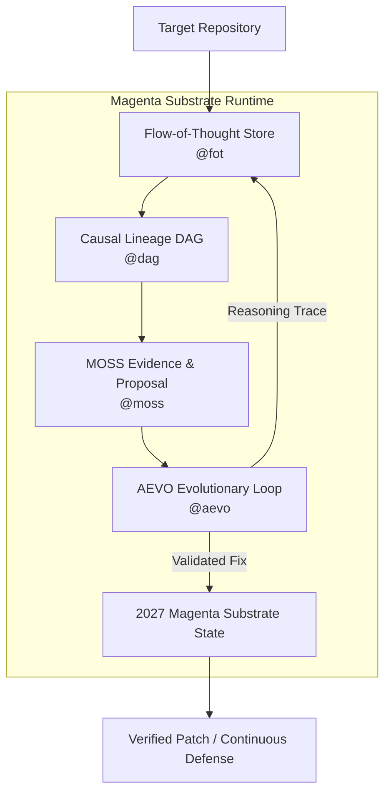

# Codex Security Evolution

`@openai/codex-security-evo` builds upon the excellent upstream release from OpenAI, into an agentic security execution framework, persistent memory substrate, and autonomous patch evolution system built for high-assurance codebases.

---

## The 2027 Substrate Gap

OpenAI's core Codex Security engine provides precise vulnerability finding, model-driven evaluation (`gpt-5.6-terra`), and root-cause finding aggregation. However, point-in-time scanning models hit an architectural ceiling when applied to long-horizon, autonomous code defense.

Static scanner invocations evaluate code as isolated snapshots. They lack stateful cognitive memory, graph-structured vulnerability tracking across refactors, and self-directed patch refinement loops. 

By 2027, production security demands an active runtime—the **Magenta Substrate**—where vulnerability detection, evidence verification, memory retention, and patch evolution run as a continuous, unified pipeline. Codex Security Evo implements this substrate over four specialized runtime engines.

---

## Architectural Foundations

The Magenta Substrate is built upon four foundational engines corresponding to the core modules in the framework:

### 1. Flow-of-Thought (`fot`)
* **Role**: Cognitive Memory & State Deposit Substrate
* **Mechanism**: Manages persistent retrieval and deposit stores (`deposit.ts`, `retrieval.ts`, `store.ts`). Instead of re-evaluating context on every run, `fot` serializes reasoning traces, contextual code fragments, and historical scan memory into an indexed retrieval graph.

### 2. Dependency & Lineage Graph (`dag`)
* **Role**: Causal Finding Alignment
* **Mechanism**: Replaces line-number matching with directed acyclic graph tracking (`core.ts`, `store.ts`). `dag` tracks vulnerability root causes across structural AST changes, file moves, and multi-commit refactors, maintaining accurate finding states (new, persisting, reopened, or resolved).

### 3. Multi-Agent Evidence & Proposal System (`moss`)
* **Role**: Verification & Patch Synthesis
* **Mechanism**: Combines evidence gathering (`evidence.ts`) with patch proposal generation (`proposal.ts`). `moss` deploys worker sub-agents that generate verifiable execution proofs, ensuring that proposed code fixes do not introduce regressions or collateral security breaks.

### 4. Agentic Evolution Engine (`aevo`)
* **Role**: Autonomous Patch Mutation & Optimization
* **Mechanism**: Implements iterative search and recommendation routines (`recommend.ts`, `state.ts`). `aevo` mutates candidate fixes generated by `moss`, runs automated validation loops, and selects optimal patch configurations based on security, performance, and style metrics.

---

## Substrate Execution & Evolution Pipeline



---

## Quick Start

### Requirements
* Node.js `22.13.0`+, `24.x`, or `26.x`
* Python `3.10`+
* OpenAI API or Codex Security account verification

### Installation & Authentication

```bash
npm install @openai/codex-security-evo
npx codex-security-evo login
```

For non-interactive or CI/CD pipelines, export your API key:

```bash
export OPENAI_API_KEY="your-api-key"
```

---

## Usage

### CLI Scanning

Run a baseline scan across the current workspace:

```bash
npx codex-security-evo scan .
```

Run an evolutionary deep scan using high-effort reasoning models:

```bash
npx codex-security-evo scan . --model gpt-5.6-terra --effort high
```

Trigger specific substrate modules directly:

```bash
# Query Flow-of-Thought memory store
npx codex-security-evo fot retrieve --query "SQL injection lineage"

# Inspect Causal Lineage Graph
npx codex-security-evo dag status

# Run MOSS evidence verification on a proposed patch
npx codex-security-evo moss verify --patch ./fix.patch

# Execute AEVO patch evolution
npx codex-security-evo aevo evolve --target src/auth/
```

---

## TypeScript SDK Integration

```typescript
import { CodexSecurityEvo } from "@openai/codex-security-evo";

const evo = new CodexSecurityEvo();

// Execute scan with Magenta Substrate persistence
const result = await evo.run(".", {
  model: "gpt-5.6-terra",
  effort: "high",
  substrate: {
    enableFoT: true,
    enableDagLineage: true,
    autoEvolve: true
  }
});

console.log(`Scan Report Generated: ${result.reportPath}`);
console.log(`Evolve Candidate Patches: ${result.proposals.length}`);

await evo.close();
```
